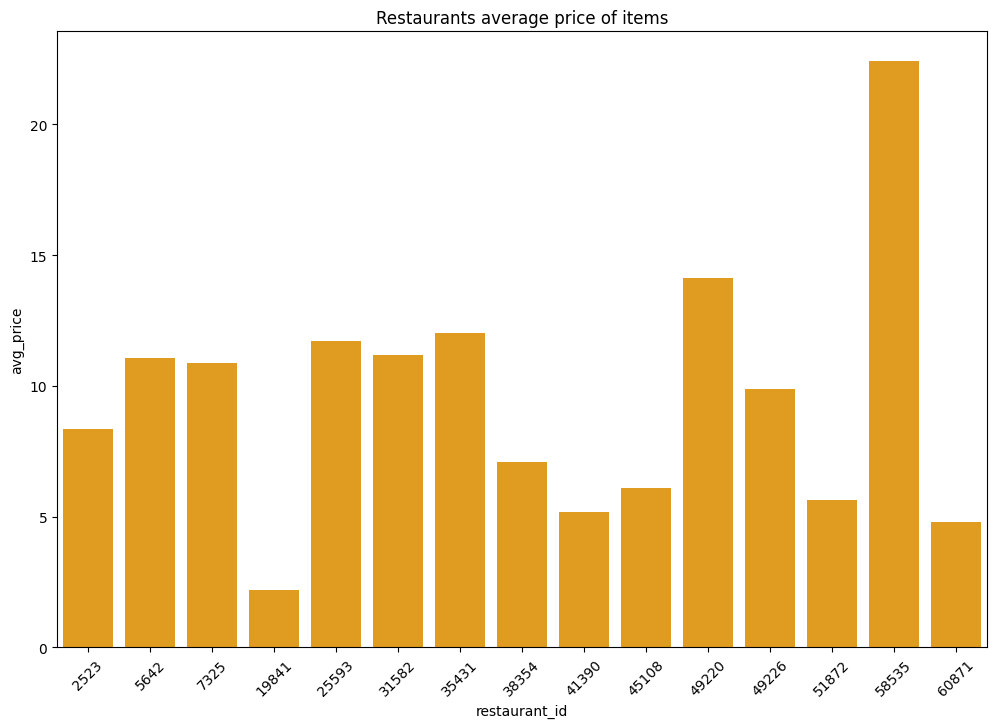
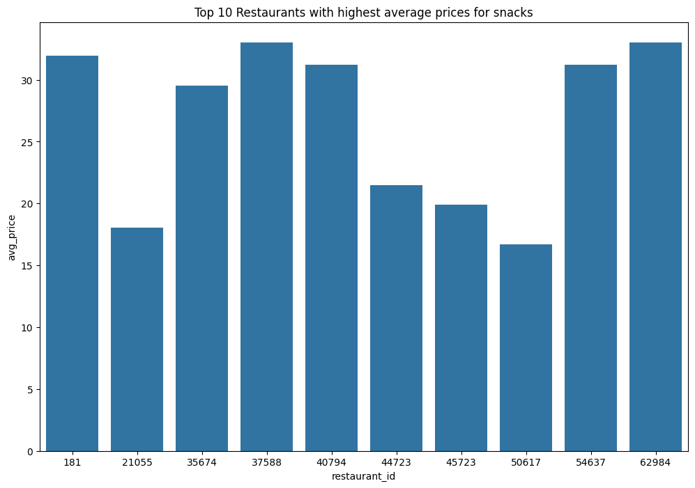
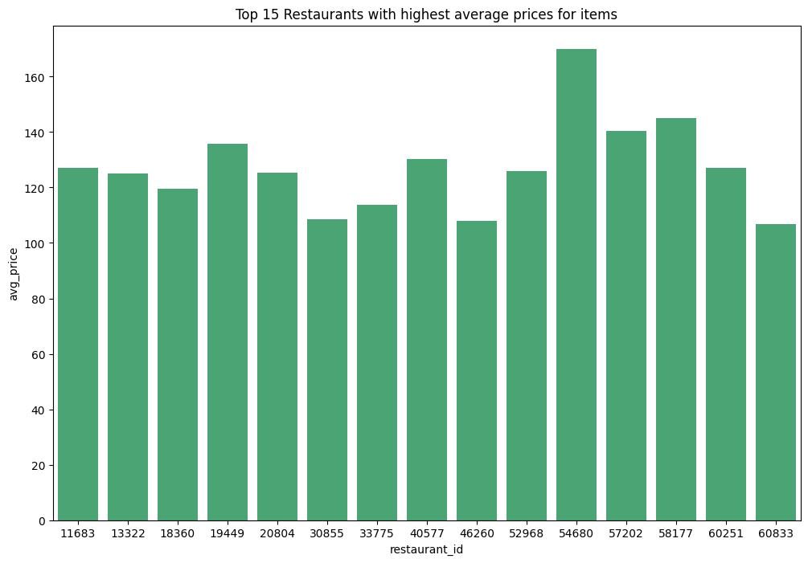

## 
<b><strong> UBER-EATS RESTAURANTS BIG DATA MENU PRICE ANALYSIS </strong></b> 
 

### 
<b> Project Overview</b> 

`Big data analytics` for delivery companies is always very necessary to uncover customer trends and patterns. Trends help these companies in optimizing their services to ensure a smooth flow of operations between riders as well as forecast future demand of various products and services. 

This project aimed to analyze the menus of various restaurants that use `uber-eats courier` as their supply company. As this is big data, the use of `OLAP-DATABASES` comes in handy to perfrom heavy analytics using `SQL`. These databases offer:

* `Scalability`: Can easily manage massive amounts of data efficiently.
* `Low latency`: Optimized for complex analytical queries due to their latency structure and optimized data structures and indexing. 
* `Batch processing`: Good for `large-scale` data processing tasks efficiently.

`Uber-Eats` customers also have the right to investigate the prices of various items on the menu to find the cheapest and most expensive restaurants to save on expenditure. The data was sourced from `kaggle` and can be accessed by using the following 

### 
<b> Objectives</b> 

1. Investigate the `number of restaurants` that use `UBER-EATS`.
2. Investigate the `top restaurants with the largest number of items.`
3. Investigate the `price range of items` for the restaurant with the highest number of items.
4. Investigate the `average price of items` across various restaurants
5. Investigate the `most expensive restaurant.`
6. `Snacks items` analysis. Analyze the price of snack items across various restaurants. 

### 
<b> Findings</b> 

### 
<b> Future steps</b> 

1. Investigate the correlation between location i.e `latitude` & `longitude` and `menu-prices`. 
2. Outsource data for `customer orders` and analyze `consumer purchasing trends`.

All the requirements to run this project are listed in the file [requirements-file](requirements.txt) together with the library versions. 
